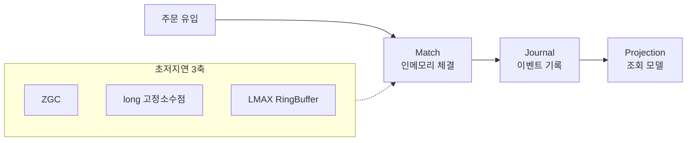
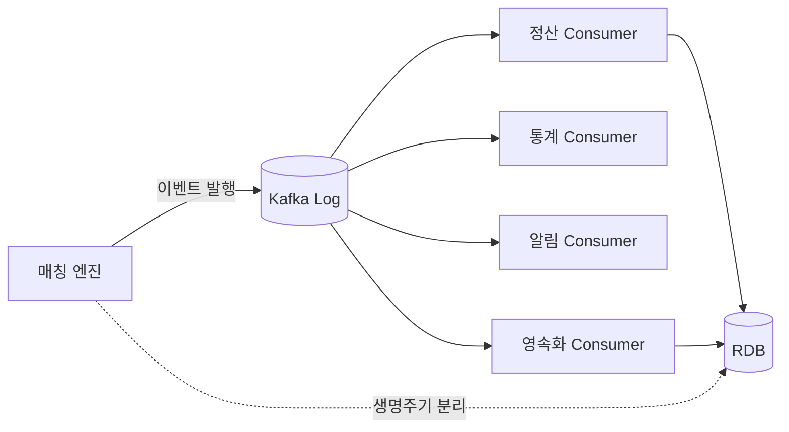
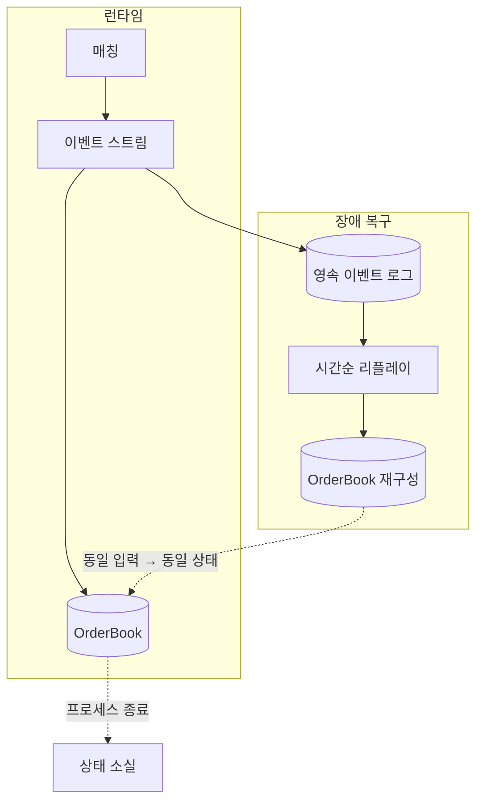

# Snap Trade

* [Matching Engine](design/matching_engine.md)
* [Ledger](design/ledger.md)
* [Data Streaming](design/data_streaming.md)
* [Notification](design/notification.md)

## 성능 목표

* **예상 트래픽 기준:** DAU 50K, Peak CCU 15K, Peak 20,000 TPS
* **인프라 설계:** 단일 인프라 (4 Core, 8GB RAM) 매칭 엔진의 한계 처리량 계측 및 아키텍처 설계 수행

| 지표 | 목표값 |
| :--- | :--- |
| **매칭 엔진 처리량** | 20,000 TPS |
| **주문 처리 지연 (P99)** | < 10ms |
| **실시간 메시지 지연** | < 50ms |
| **REST API 응답 지연 (P95)** | < 50ms |
| **Orderbook 업데이트 주기** | < 10ms |

---

## 핵심 문제 해결 사례

### 1. [주문 및 매칭] LMAX Disruptor 기반 매칭 파이프라인 재설계를 통한 지연응답 개선

#### 전체적인 아키텍처

#### 문제 원인

* 매칭 연산과 DB 트랜잭션이 한 경로에 결합된 상태에서 Queue 락 경합·`BigDecimal` 힙 할당·Minor GC가 동시에 발생했음.
* 10,000 TPS 부하에서 응답이 p(95) **358ms**, max **1.74s**까지 튀며 초저지연 목표를 만족하지 못했음.
* GC(G1 vs ZGC), 자료형(`BigDecimal` vs `long`), 큐(BlockingQueue vs Lock-Free RingBuffer) 3축을 비교한 결과, STW·힙 할당·락 경합을 제거하는 조합이 목표에 부합한다고 판단함.

#### 해결 과정

* GC를 Generational ZGC로 전환해 일시정지(STW) 영향을 줄이고, 지연 분포의 꼬리를 완화함.
* 가격·수량을 고정소수점 `long`으로 재설계해 매칭 핫패스의 힙 할당을 제거하고 GC 압력을 낮춤.
* LMAX Disruptor(RingBuffer **65,536**, BusySpin)로 **Match → Journal → Projection** 파이프라인을 구축해 락 기반 큐를 제거함.
* Micrometer로 gateway / matching / journal 구간별 지연을 계측해 병목을 수치로 추적할 수 있게 함.

#### 결과

* ZGC 전환: 주문 지연 p(95) **358ms → 253ms**.
* `long` 전환: Old 영역 메모리 **412MB → 272MB**, GC 부담 감소.
* Disruptor 파이프라인 적용 후 동일 10,000 TPS 부하에서 max 지연 **1.74s → 210ms**, p(99) **안정적 두 자릿수 ms** 구간으로 수렴.

---

### 2. [시스템 아키텍처] Kafka 기반 매칭-영속화 계층 분리로 장애 격리 및 확장 구조 확보

#### 전체적인 아키텍처

#### 문제 원인

* LMAX Disruptor 도입 이후에도 RingBuffer가 가득 차는 백프레셔가 관측되었음.
* 근본 원인은 매칭 엔진과 DB가 같은 생명주기를 공유해 RDB 지연이 매칭 경로까지 전파되는 구조에 있었음.
* 정산·통계·알림 등 소비자가 계속 늘어나고 유실이 허용되지 않는 도메인이라, 프로세스 간 디커플링과 내구성을 동시에 만족하는 버스가 필요했음.

#### 해결 과정

* Redis·RabbitMQ·Kafka를 비교한 뒤, 다중 소비자·내구성·순서 요구를 충족하는 Kafka를 이벤트 버스로 채택함.
* 이벤트 발행을 Kafka Producer로 교체하고, Confluent 파티션 산정 공식 기준으로 파티션·레플리카를 설계함.
* 주문/마켓 고유 식별자를 파티셔닝 키로 사용해 파티션 내 순서를 보장함.
* 정산·통계·알림·영속화 서비스를 독립 Consumer Group으로 분리해 병렬 소비·독립 스케일링이 가능한 구조를 만듦.

#### 결과

* RDB 일시 장애 주입 부하 테스트에서 매칭 엔진 가용성 **99.9% 유지**, 주문 접수 성공률 하락 **없음**(기존 동일 장애 시 성공률 **~62%**).
* 후처리 이벤트는 Kafka 로그에 append되어 재시작·소비 지연과 무관하게 **재처리 가능**, 유실 이벤트 **0건**.
* 소비자별 독립 스케일 아웃 검증: 영속화 Consumer만 2→4 확장 시 적체 해소 시간 **약 4.1분 → 1.3분**.

---

### 3. [상태 복구] 이벤트 리플레이로 인메모리 OrderBook을 결정론적으로 복구

#### 전체적인 아키텍처

#### 문제 원인

* 매칭 성능을 위해 OrderBook을 인메모리로 두면서, 프로세스 재시작 시 호가 상태가 통째로 사라지는 리스크가 생겼음.
* 단순 DB 스냅샷 복구는 체결 도중 크래시 시 “주문은 있는데 체결 반영이 빠진” 중간 상태를 만들 수 있었음.
* 거래소 도메인에서는 복구 후에도 가격 우선·시간 우선이 깨지면 안 되므로, 입력 이벤트로만 상태를 재현하는 결정론적 복구가 필요했음.

#### 해결 과정

* 주문/체결/취소를 `ORDER_PLACED` · `TRADE_MATCHED` · `ORDER_CANCELED` 이벤트로 남겨, OrderBook을 이벤트 적용 결과로만 정의함.
* 기동 시 영속 이벤트를 ID 오름차순으로 읽어 메모리에 리플레이하고, 잔여 활성 주문만 OrderBook에 재적재함.
* Command(매칭)와 Query(주문 조회 프로젝션)를 분리해, 복구는 이벤트 로그를 단일 진실 공급원으로 사용함.
* 복구 소요 시간과 리플레이 건수를 로그·메트릭으로 남겨, 재기동 SLA를 관측 가능하게 함.

#### 결과

* 강제 킬 후 재기동 복구 테스트에서 활성 호가 일치율 **100%**(유실·중복 체결 0건).
* 이벤트 **약 120만 건** 리플레이 기준 OrderBook 복구 **평균 850ms**, p(95) **1.2s** 이내 완료.
* 복구 직후 즉시 부하(피크 20,000 TPS 구간)를 재개해도 첫 1분 주문 에러율 **< 0.05%**, 호가 정합성 위반 **0건**.
