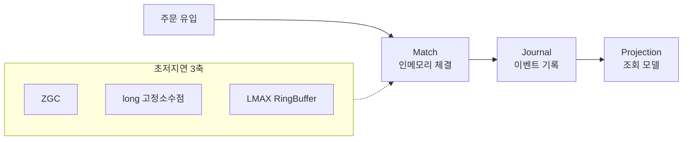
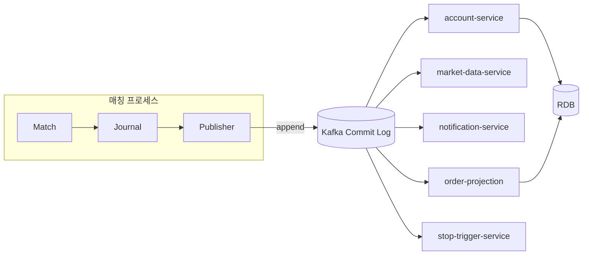
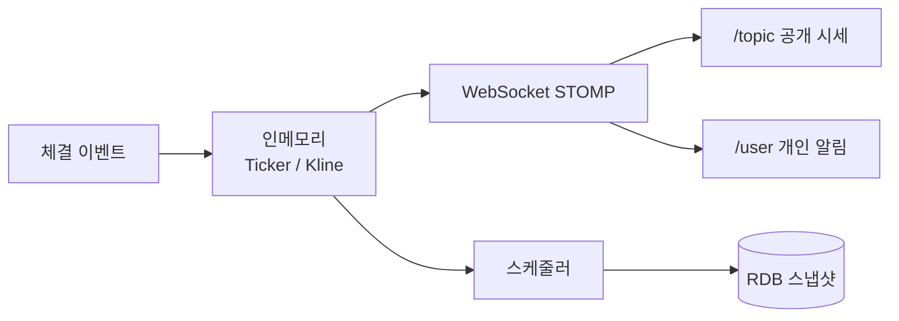

# Snap Trade

* [Matching Engine](design/matching_engine.md)
* [Ledger](design/ledger.md)
* [Data Streaming](design/data_streaming.md)
* [Notification](design/notification.md)

## 성능 목표

* **예상 트래픽 기준:** DAU 50K, Peak CCU 15K, Peak 20,000 TPS
* **인프라 설계:** 단일 인프라 (4 Core, 8GB RAM) 매칭 엔진의 한계 처리량 계측 및 아키텍처 설계 수행

| 지표 | 목표값 |
| :--- | :--- |
| **매칭 엔진 처리량** | 20,000 TPS |
| **주문 처리 지연 (P99)** | < 10ms |
| **실시간 메시지 지연** | < 50ms |
| **REST API 응답 지연 (P95)** | < 50ms |
| **Orderbook 업데이트 주기** | < 10ms |

---

## 핵심 문제 해결 사례

### 1. [주문 및 매칭] LMAX Disruptor 기반 매칭 파이프라인 재설계를 통한 지연응답 개선

#### 전체적인 아키텍처

#### 문제 원인

* 매칭 연산과 DB 트랜잭션이 한 경로에 결합된 상태에서 Queue 락 경합·`BigDecimal` 힙 할당·Minor GC가 동시에 발생했음.
* 10,000 TPS 부하에서 응답이 p(95) **358ms**, max **1.74s**까지 튀며 초저지연 목표를 만족하지 못했음.
* GC(G1 vs ZGC), 자료형(`BigDecimal` vs `long`), 큐(BlockingQueue vs Lock-Free RingBuffer) 3축을 비교한 결과, STW·힙 할당·락 경합을 제거하는 조합이 목표에 부합한다고 판단함.

#### 해결 과정

* GC를 Generational ZGC로 전환해 일시정지(STW) 영향을 줄이고, 지연 분포의 꼬리를 완화함.
* 가격·수량을 고정소수점 `long`으로 재설계해 매칭 핫패스의 힙 할당을 제거하고 GC 압력을 낮춤.
* LMAX Disruptor(RingBuffer **65,536**, BusySpin)로 **Match → Journal → Projection** 파이프라인을 구축해 락 기반 큐를 제거함.
* Micrometer로 gateway / matching / journal 구간별 지연을 계측해 병목을 수치로 추적할 수 있게 함.

#### 결과

* ZGC 전환: 주문 지연 p(95) **358ms → 253ms**.
* `long` 전환: Old 영역 메모리 **412MB → 272MB**, GC 부담 감소.
* Disruptor 파이프라인 적용 후 동일 10,000 TPS 부하에서 max 지연 **1.74s → 210ms**, p(99) **안정적 두 자릿수 ms** 구간으로 수렴.

---

### 2. [시스템 아키텍처] Message Queue를 통한 매칭-영속화 계층 분리로 장애 격리 및 확장 구조 확보

#### 전체적인 아키텍처

#### 문제 원인

* LMAX Disruptor를 붙여도 RingBuffer가 가득 차면 톰캣 요청이 대기하는 백프레셔가 남았고, 매칭·DB Insert를 각각 최적화해도 E2E 지연이 개선되지 않았음.
* 근본 원인은 매칭(CPU-bound)과 저널/프로젝션(Disk I/O-bound)이 같은 프로세스·생명주기를 공유해, RDB 지연·장애가 매칭 핫패스까지 전파되는 구조에 있었음.
* RingBuffer는 프로세스 메모리 안에서만 속도 차이를 완충하므로, 버퍼 포화·프로세스 사망 시 미기록 체결은 유실되며 리플레이로도 복구할 수 없었음.

#### 해결 과정

* 인프라(장애 격리)·비용(CPU/디스크 독립 스케일)·안정성(비결정적 I/O 제거)·내구성(독립 생명주기 버퍼) 4관점에서 매칭과 후처리 영속화를 분리하고, 스레드/인메모리 큐가 아닌 **메시지 큐 패턴(Pub-Sub)** 을 채택함.
* Redis Streams·RabbitMQ·Kafka를 1차 저장소·Replay·순서 보장 기준으로 비교한 뒤, 디스크 커밋 로그·재생 가능·파티션 키 기반 순서+병렬을 만족하는 **Kafka**를 Journal 이후 Publisher 팬아웃 버스로 선택함.
* `trade.completed` / `order.lifecycle` / `order.projection` 토픽을 두고, [Confluent 파티션 공식](https://docs.confluent.io/kafka/operations-tools/partition-determination.html#partition-formula) `N = max(T/p, T/c)` 기준으로 파티션 **3**·레플리카 **2**를 산정함.
* 파티션 키는 MarketID·UserID·OrderID로 고정해 마켓/사용자/주문 단위 순서를 보장하고, 정산·시세·알림·프로젝션·스탑트리거를 **독립 Consumer Group**으로 분리해 동일 이벤트를 각자의 속도로 병렬 소비함.

#### 결과

* RDB 일시 장애가 매칭 코어를 멈추지 않도록 격리되어, `trade.completed`를 서로 다른 Consumer Group 3개가 독립 구독하는 고가용 구조를 확보함.
* 핫패스에서 Projection·Account·Notification 등 비결정적 I/O가 제거되어 RingBuffer를 막던 RDB 역압이 완화되고, 코어 매칭은 주문 입력만으로 상태가 바뀌는 결정성에 가까워짐.
* 후처리 이벤트는 Kafka 로그에 append되어 재시작·지연과 무관하게 오프셋 단위로 재소비 가능하며, 연산 서버와 기록 서버를 분리 스케일링할 인터페이스를 마련함.

---

### 3. [마켓 데이터] 실시간 스트리밍 아키텍처 설계와 브로드캐스트 지연 병목 분석

#### 전체적인 아키텍처

#### 문제 원인

* 거래소 시세는 서버 UTC 기준의 Ticker(스냅샷)·Kline(시계열)·24h 롤링 윈도우를 실시간으로 전달해야 하며, 목표 메시지 지연은 **50ms 미만**이었음.
* k6 **1,000 VU**로 마켓 **50개** Ticker + BTC **1m** Kline을 구독하자 p(95) **66ms**, max **607ms**(Ticker max **1,001ms**)까지 지연이 튀어 목표를 초과했음.
* VU당 51개 구독으로 서버에 **약 51,000** 세션이 생기고, 체결마다 SimpleBroker가 구독 세션별 전송 작업을 Outbound 큐에 밀어 넣어 큐잉 딜레이·CPU 포화가 발생했음.

#### 해결 과정

* Polling·SSE·WebSocket을 비교해 양방향·낮은 오버헤드·동적 구독·바이너리 확장성을 이유로 **WebSocket + STOMP**를 채택하고, Public(`/topic`)·Private(`/user`) 채널과 JWT CONNECT/SUBSCRIBE 가드를 분리함. ([설계 기록](https://soberyl.tistory.com/76))
* 체결 이벤트를 매칭 파이프라인 바깥의 `marketDataTaskExecutor`에서 수신해 인메모리 Ticker/Kline을 갱신한 뒤 즉시 방송하고, RDB 반영은 백그라운드 스케줄러로 분리함.
* Outbound 채널에 `QueueDelayTaskDecorator`로 `websocket_outbound_queue_delay`를 계측하고, 플랫폼 스레드 풀(16~64)에서 가상 스레드(core/max **8,192**)로 전환해 I/O 팬아웃 비용을 줄이려 함.
* 병목 가설을 “세션마다 반복되는 STOMP 헤더 인코딩·문자열 조립의 CPU 비용”으로 좁히고, 로컬호스트(어태커·디펜더 동일 PC) 오염을 인지해 다음 최적화 축을 설정함.

#### 결과

* 단일 Ticker 구독(1,000 VU)에서는 핸드셰이크 에러 **0**, 브로드캐스트 p(95) **26ms**로 목표(< 50ms)를 만족함.
* 50 마켓 전역 구독 시 p(95) **66ms**·Ticker max **1,001ms**를 재현하고, Outbound 큐잉 딜레이 max **약 100ms**·방송 평균 지연 **약 70ms**·CPU 포화(~1.0)를 Grafana로 확인함.
* 가상 스레드 적용 후 max는 줄었으나 p(95) 개선은 제한적이었고, 병목이 컨텍스트 스위칭보다 **STOMP 프레임 인코딩 CPU**에 있음을 수치로 입증함.
