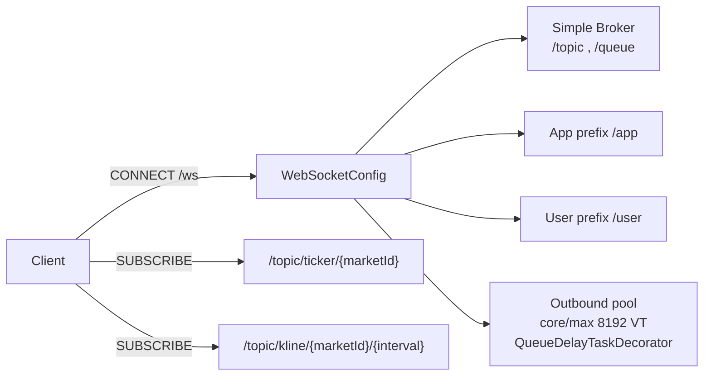
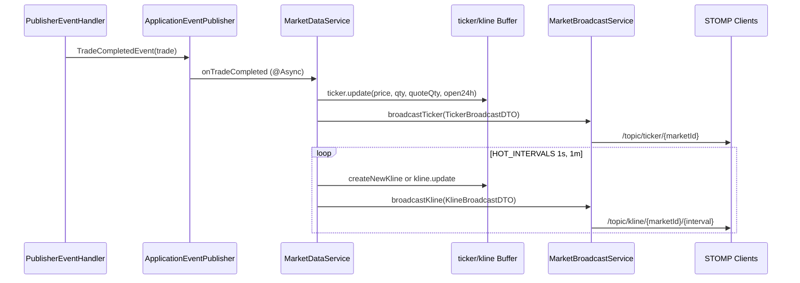
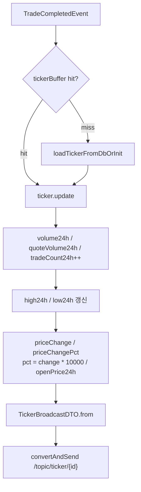
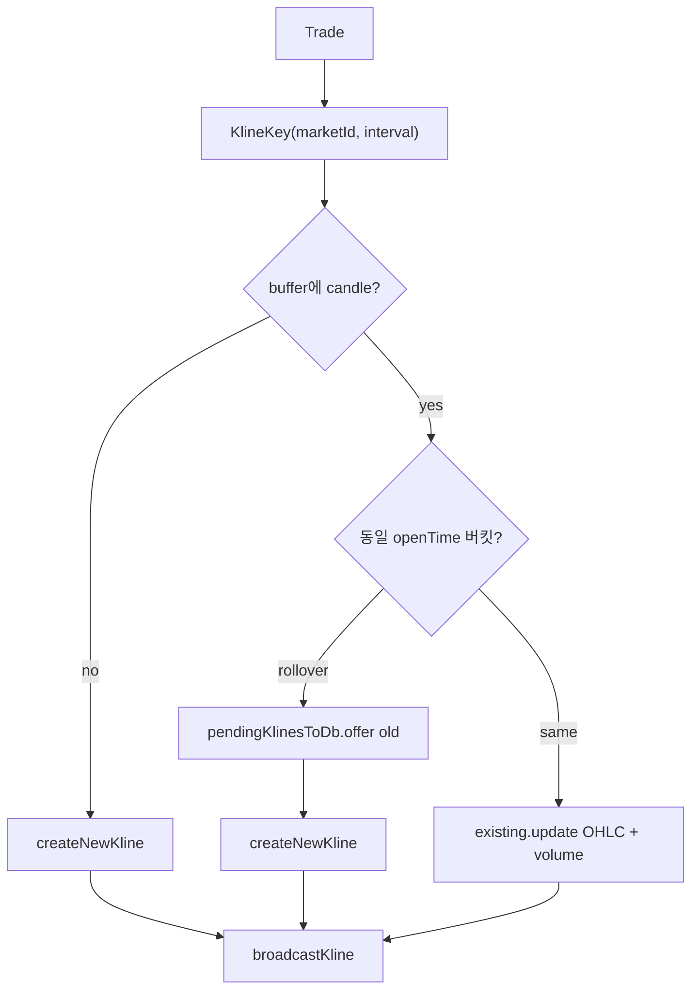
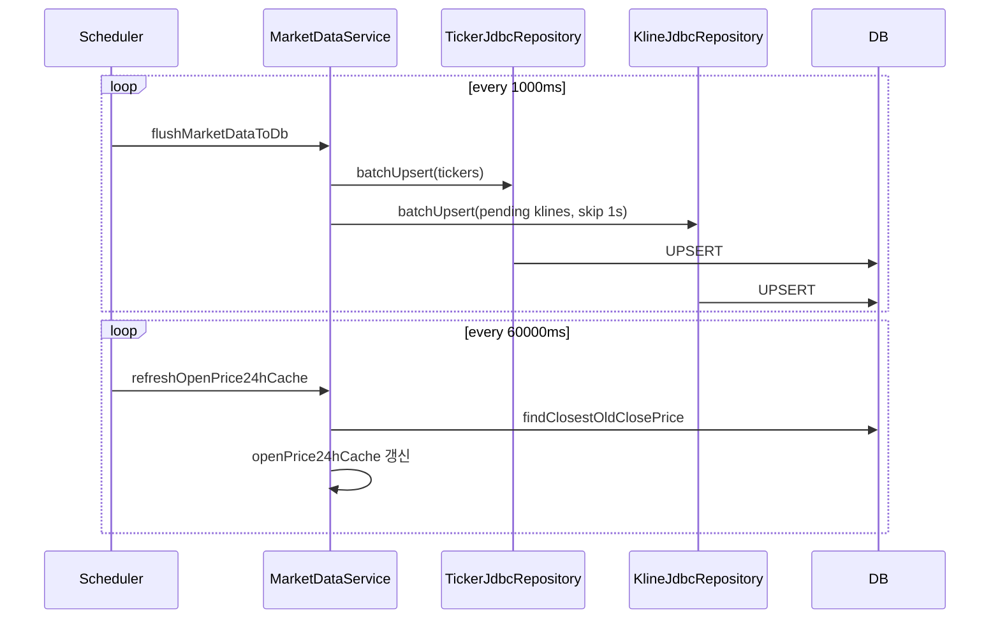
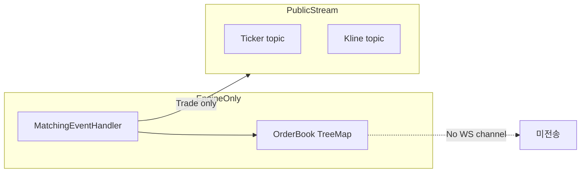

# Market Data Streaming Design

체결 이벤트를 구독해 Ticker / Kline을 인메모리로 갱신하고, STOMP 토픽으로 실시간 방송하는 설계입니다.  
OrderBook depth는 매칭 엔진 내부 전용이며 WebSocket으로 송출하지 않습니다.

## 1. 전체 아키텍처

```mermaid
flowchart TB
    subgraph Source
        PH[PublisherEventHandler]
        Mock[MockTradeGenerator]
        TCE[TradeCompletedEvent]
        PH --> TCE
        Mock --> TCE
    end

    subgraph MarketData
        MDS[MarketDataService]
        TB[(tickerBuffer)]
        KB[(klineBuffer)]
        Pend[(pendingKlinesToDb)]
        MDS --> TB
        MDS --> KB
        MDS --> Pend
    end

    subgraph Broadcast
        MBS[MarketBroadcastService]
        STOMP[SimpMessagingTemplate]
        MBS --> STOMP
    end

    subgraph Persist
        Flush["@Scheduled 1s flush"]
        TJ[TickerJdbcRepository]
        KJ[KlineJdbcRepository]
        DB[(ticker / kline)]
        Flush --> TJ --> DB
        Flush --> KJ --> DB
    end

    TCE -->|@Async marketDataTaskExecutor| MDS
    MDS -->|@Async webSocketTaskExecutor| MBS
    Pend --> Flush
    TB --> Flush
```

## 2. STOMP / WebSocket 구성



| 항목 | 값 |
| :--- | :--- |
| Endpoint | `/ws` |
| Allowed origins | `*` |
| Security | `/ws/**` permitAll |
| Outbound threads | virtual threads `ws-outbound-vt-*` |
| Queue delay metric | `websocket_outbound_queue_delay` (warn > 100ms) |

## 3. 체결 → 시세 방송 시퀀스



## 4. Ticker 갱신 로직



### TickerBroadcastDTO 필드

`marketId`, `lastPrice`, `priceChange`, `priceChangePct`, `high24h`, `low24h`, `volume24h`, `quoteVolume24h`, `tradeCount24h`, `timestamp`

## 5. Kline 버킷 처리



| Interval | 코드 | DB flush |
| :--- | :--- | :--- |
| 1초 | `ChartInterval.SEC_1` (`1s`) | 스킵 (메모리 전용) |
| 1분 | `ChartInterval.MIN_1` (`1m`) | batchUpsert |

### KlineBroadcastDTO 필드

`marketId`, `interval`, `openTimeMs`, `openPrice`, `highPrice`, `lowPrice`, `closePrice`, `volume`, `quoteVolume`, `timestamp`

## 6. 영속화 스케줄



## 7. 데이터 경계 (OrderBook 미방송)



* 공개 스트림: **Ticker / Kline**
* OrderBook depth REST/WS API 없음
* 부하 테스트 구독 예: `/topic/ticker/{1..50}`, `/topic/kline/1/1m`

## 8. 비동기 실행 경계

| Executor | 담당 |
| :--- | :--- |
| `marketDataTaskExecutor` | `MarketDataService.onTradeCompleted` |
| `webSocketTaskExecutor` | `MarketBroadcastService` 송신 |
| STOMP outbound pool | 실제 소켓 write + queue delay 계측 |

매칭 핫 패스와 시세 가공/송신을 분리해, 방송 지연이 매칭 P99에 영향을 주지 않도록 설계합니다.
