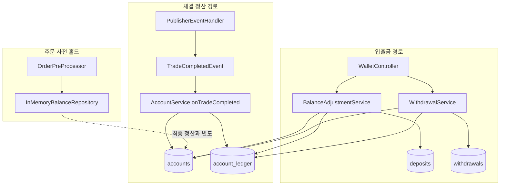
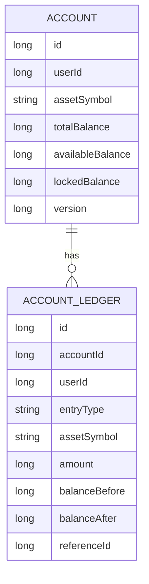
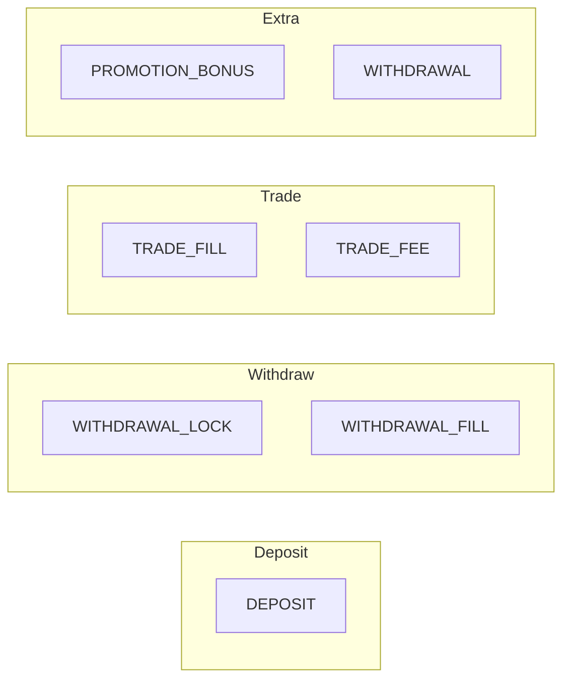
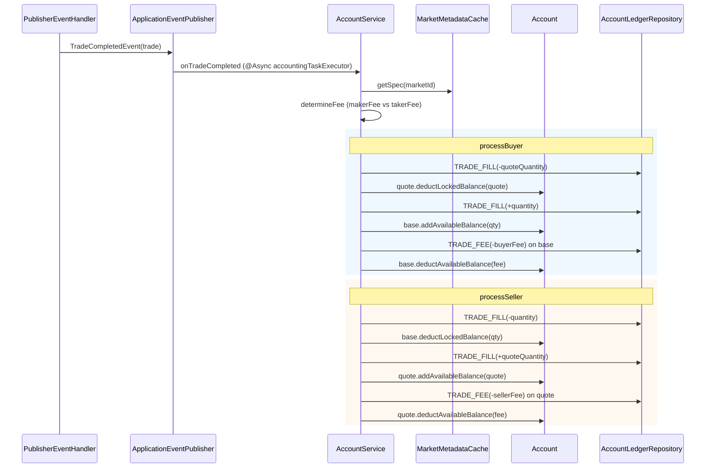
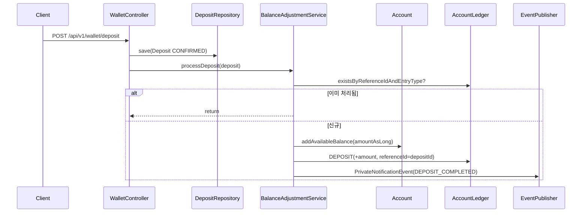
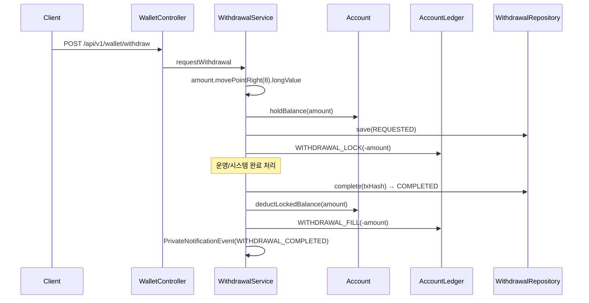
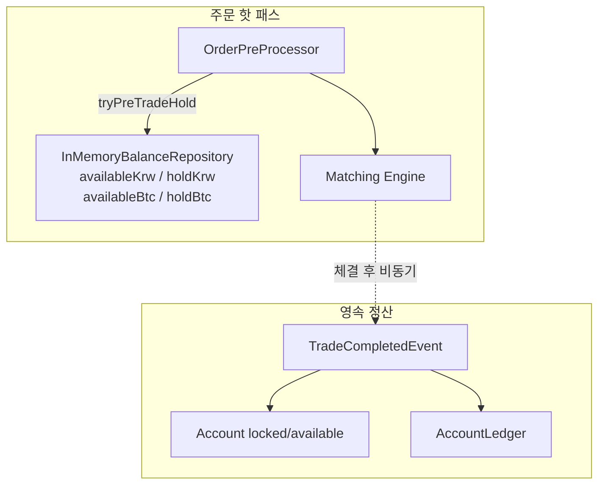

# Ledger & Account Design

체결 이후 자산 이동을 이중 기록(잔고 + 원장)으로 보장하는 계정/원장 설계입니다.  
사전 주문 홀드는 인메모리, 최종 정산은 `Account` + `AccountLedger`로 분리됩니다.

## 1. 전체 아키텍처

## 2. 계정 모델

### 잔고 연산

| Method | 효과 |
| :--- | :--- |
| `holdBalance(amount)` | available → locked |
| `releaseBalance(amount)` | locked → available |
| `deductLockedBalance(amount)` | total↓, locked↓ |
| `addAvailableBalance(amount)` | total↑, available↑ |
| `deductAvailableBalance(amount)` | total↓, available↓ |

* `(user_id, asset_symbol)` unique
* `@Version` 낙관적 락으로 동시 정산 충돌 감지

## 3. 원장 엔트리 타입

| LedgerEntryType | 용도 |
| :--- | :--- |
| `DEPOSIT` | 입금 반영 |
| `WITHDRAWAL_LOCK` | 출금 요청 시 잠금 |
| `WITHDRAWAL_FILL` | 출금 완료 차감 |
| `TRADE_FILL` | 체결 자산 이동 |
| `TRADE_FEE` | 수수료 차감 |
| `PROMOTION_BONUS` | 보너스 |
| `WITHDRAWAL` | (레거시/일반) 출금 |

## 4. 체결 정산 시퀀스

### 수수료 자산 규칙

* **Buyer fee** → base asset에서 차감
* **Seller fee** → quote asset에서 차감
* 원장 기록은 잔고 변경 **직전**에 수행 (`balanceAfter = balanceBefore + amount`)

## 5. 입금 플로우

## 6. 출금 플로우

## 7. Pre-trade Hold vs Ledger 경계

| 구분 | 저장소 | 역할 |
| :--- | :--- | :--- |
| Pre-trade | `InMemoryBalanceRepository` | 주문 수락 전 빠른 홀드/검증 |
| Settlement | `Account` + `AccountLedger` | 체결·입출금의 최종 무결성 |

> 스케일 주의: 출금은 `movePointRight(8)`, 입금은 `BigDecimal.longValue()` 경로가 혼재하므로 운영 시 단위 통일이 필요함.

## 8. 불변성 규칙

1. `account_ledger`는 append-only (수정/삭제 없음)
2. 동일 `referenceId + entryType` 중복 적재 방지 (입금 idempotency)
3. 모든 잔고 변경은 대응 원장 row와 1:1로 묶임
4. 체결 정산은 `@Transactional` + 낙관적 락으로 원자성 보장
