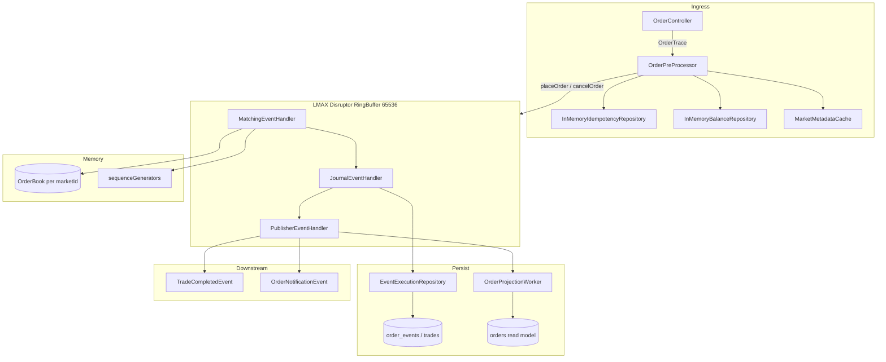
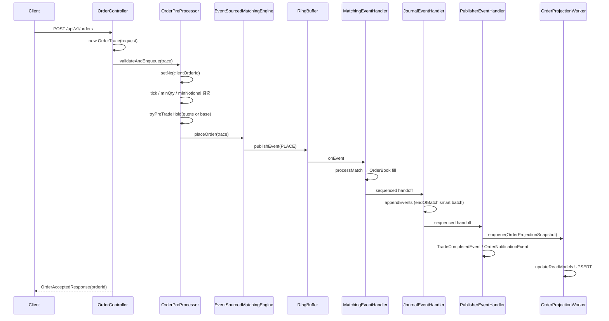
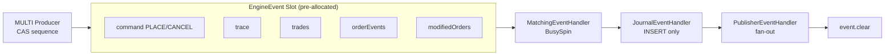
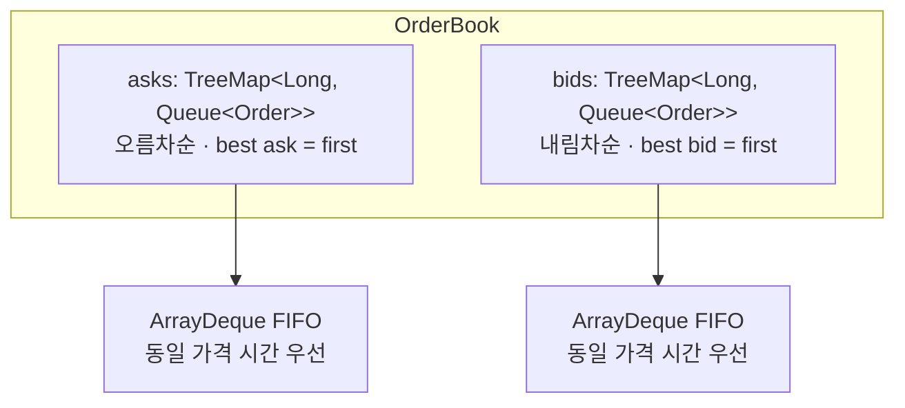
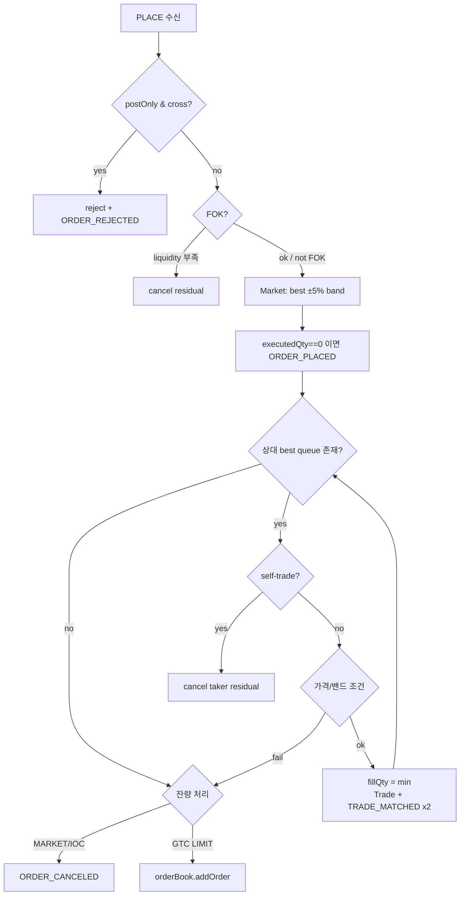
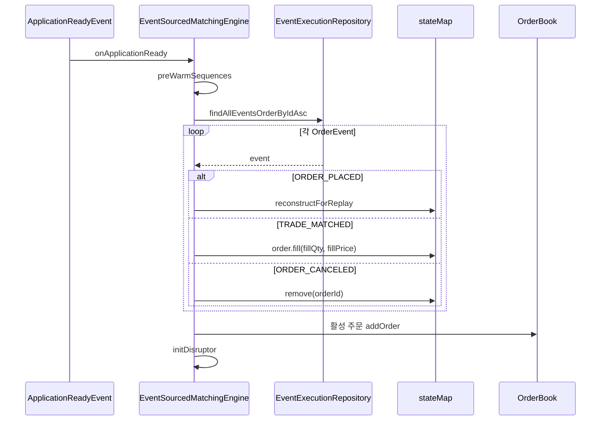
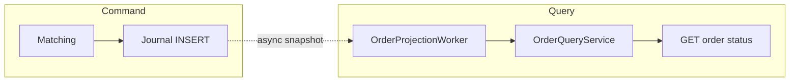

# Matching Engine Design

이벤트 소싱 + LMAX Disruptor 기반 인메모리 매칭 엔진 설계입니다.  
핫 패스는 `EventSourcedMatchingEngine`이며, 레거시 `AsyncMatchingEngine`은 비교용으로만 존재합니다.

## 1. 전체 아키텍처

## 2. 주문 접수 시퀀스

## 3. Disruptor 파이프라인 상세

| 설정 | 값 |
| :--- | :--- |
| bufferSize | 65,536 |
| ProducerType | `MULTI` |
| WaitStrategy | `BusySpinWaitStrategy` |
| ThreadFactory | `DaemonThreadFactory` |
| Chain | Matching → Journal → Publisher |

## 4. OrderBook 데이터 구조

* 가격·수량은 `long` 고정소수점 (스케일 `10^8`)
* 마켓별 `ConcurrentHashMap<Long, OrderBook>`에 보관
* Disruptor 단일 컨슈머이므로 OrderBook mutation은 실질 single-thread

## 5. 매칭 알고리즘 (`processMatch`)

## 6. 이벤트 소싱 & 복구

### EventType

| 타입 | 의미 |
| :--- | :--- |
| `ORDER_PLACED` | 신규 주문 접수 (payload: marketId, userId, side, price, origQty) |
| `TRADE_MATCHED` | 체결 (fillQty, fillPrice) |
| `ORDER_CANCELED` | 취소 |
| `ORDER_REJECTED` | 거절 (post-only 등) |

## 7. 도메인 필드 (핫 패스)

| Entity | 핵심 필드 |
| :--- | :--- |
| `Order` | `price`, `origQty`, `executedQty`, `cumulativeQuoteQty` (`long`), `side`, `orderType`, `timeInForce`, `status`, `sequenceNo` |
| `Trade` | `price`, `quantity`, `quoteQuantity`, `makerFee`, `takerFee`, maker/taker/buyer/seller userId |
| `OrderEvent` | `orderId`, `tradeId`, `eventType`, `statusBefore/After`, `fillQty`, `fillPrice`, `payload` |
| Fee | `(price * qty) / 100_000_000L` → `(notional * feeRate) / 1_000_000L` |

## 8. CQRS 경계

* Journal은 `trades` / `order_events` INSERT만 수행 (`orders` 미기록)
* Read model은 `OrderProjectionWorker`가 last-write-wins UPSERT
* 조회 시 프로젝션 지연이면 일시적 404 가능
