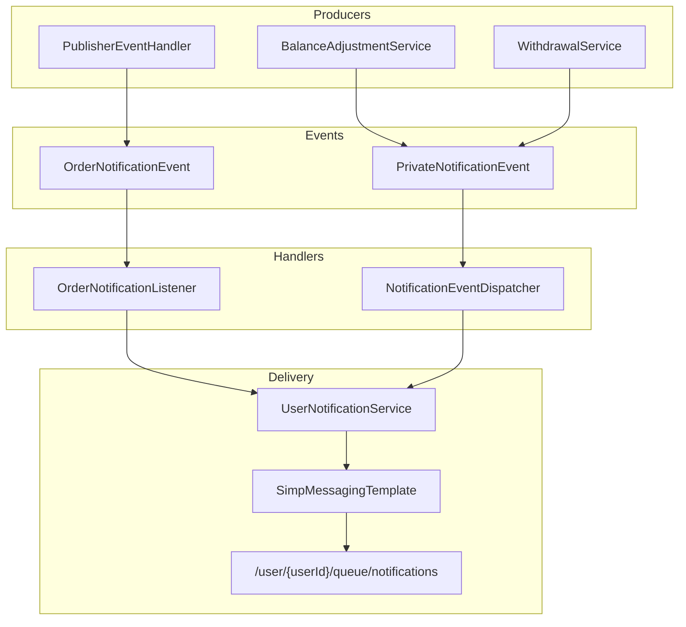
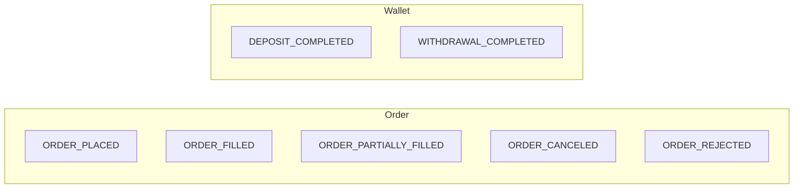
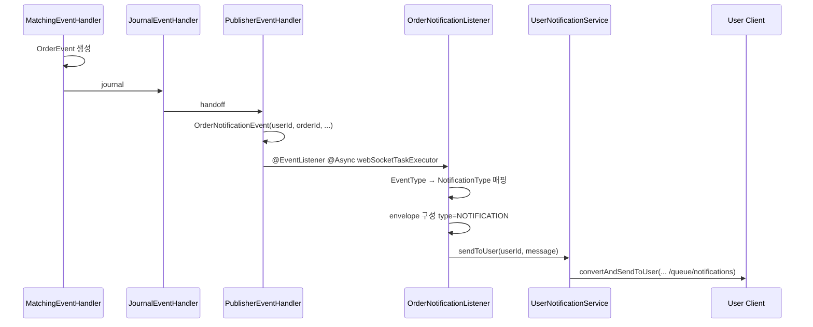
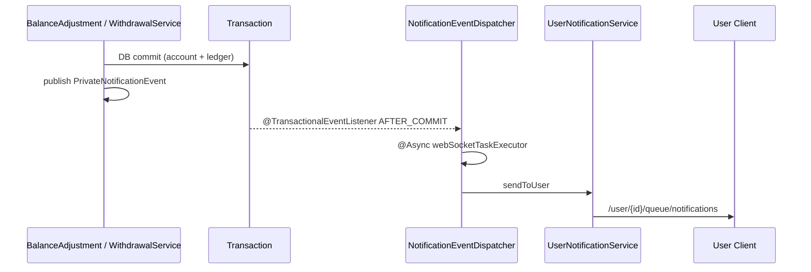
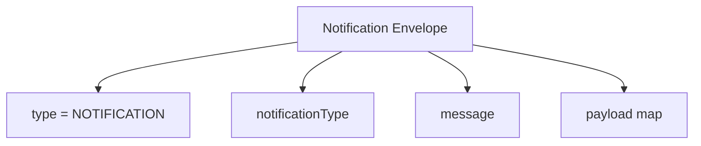
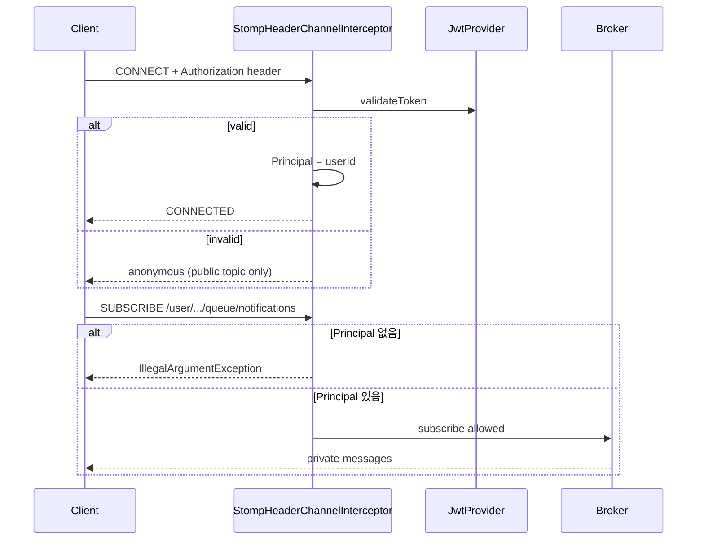
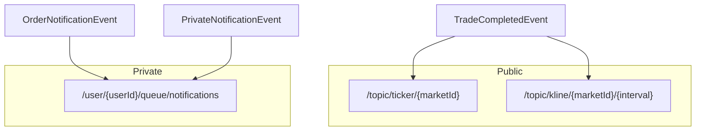
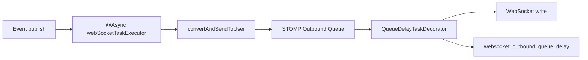

# Notification Design

주문 생명주기·입출금 완료를 사용자별 private STOMP 큐로 전달하는 알림 설계입니다.  
공개 시세(`/topic`)와 분리된 `/user/{id}/queue/notifications` 채널을 사용합니다.

## 1. 전체 아키텍처



## 2. 알림 타입



| NotificationType | 트리거 |
| :--- | :--- |
| `ORDER_PLACED` | `EventType.ORDER_PLACED` |
| `ORDER_FILLED` | `TRADE_MATCHED` + status `FILLED` |
| `ORDER_PARTIALLY_FILLED` | `TRADE_MATCHED` + status `PARTIALLY_FILLED` |
| `ORDER_CANCELED` | `ORDER_CANCELED` |
| `ORDER_REJECTED` | `ORDER_REJECTED` |
| `DEPOSIT_COMPLETED` | 입금 원장 반영 후 |
| `WITHDRAWAL_COMPLETED` | 출금 완료 처리 후 |

## 3. 주문 알림 시퀀스



### OrderNotificationEvent 필드

`userId`, `orderId`, `marketId`, `eventType`, `statusBefore`, `statusAfter`, `fillQty`, `fillPrice`, `executedQty`, `origQty`

### Payload (체결 시)

```text
orderId, marketId, status, fillQty, fillPrice, executedQty, origQty
```

## 4. 입출금 알림 시퀀스



| Publisher | notificationType | payload |
| :--- | :--- | :--- |
| `BalanceAdjustmentService.processDeposit` | `DEPOSIT_COMPLETED` | `assetSymbol`, `amount` |
| `WithdrawalService.completeWithdrawal` | `WITHDRAWAL_COMPLETED` | `assetSymbol`, `amount`, `txHash` |

> 입출금은 **커밋 이후**에만 송신하여, 롤백된 잔고 변경에 대한 알림 유령 송신을 방지합니다.

## 5. 메시지 Envelope



공통 JSON 형태:

| key | 설명 |
| :--- | :--- |
| `type` | 고정 `"NOTIFICATION"` |
| `notificationType` | `NotificationType` enum 이름 |
| `message` | 사용자 표시용 문자열 |
| `payload` | 도메인별 상세 map |

## 6. 인증 & 구독 보안



| 규칙 | 내용 |
| :--- | :--- |
| CONNECT | `Authorization` 헤더 JWT 검증 시 Principal=userId |
| `/user/**` SUBSCRIBE | 인증 필수 |
| `/topic/**` | 공개 (시세) |

## 7. 공개 스트림 vs Private 알림



| 채널 | 대상 | 데이터 |
| :--- | :--- | :--- |
| `/topic/...` | 전원 | Ticker / Kline |
| `/user/.../queue/notifications` | 본인만 | 주문·입출금 알림 |

## 8. 비동기·지연 계측



* 주문 알림: `@EventListener` + `@Async`
* 지갑 알림: `@TransactionalEventListener(AFTER_COMMIT)` + `@Async`
* outbound 대기 > 100ms 시 warn 로그
* 매칭/저널 스레드에서는 알림 I/O를 수행하지 않음
